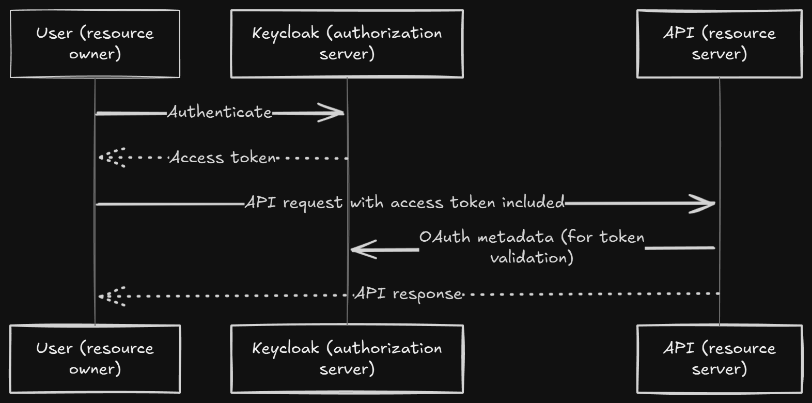

# Plan of Exeucution Phase 1 Super-Memo



### Phase 1: Keycloak Authentication Setup
1. Install dependencies :
```
npm install keycloak-connect 
passport-keycloak-bearer @nestjs/
passport
```
2. Configure Keycloak :
   - Create Keycloak realm/client
   - Setup roles (admin, user)
   - Configure redirect URIs
3. Implement Auth Module :
```36a4fedce3dd6e1a3e55e3520a3d6f987e81b85d4869bd3b68f99197e4a530f4
// src/auth/auth.module.ts
@Module({
  imports: [PassportModule],
  providers: [KeycloakStrategy, 
  AuthService],
  exports: [AuthService]
})
export class AuthModule {}
```
### Phase 2: Database Integration
1. Install TypeORM :
```
npm install typeorm @nestjs/typeorm pg
```
2. Configure database connection in app.module.ts
3. Create entities : User (linked to Keycloak) and Card
4. Migrate existing cards from JSON to database
### Phase 3: RBAC Implementation
1. Create AuthGuard for role validation
2. Protect routes with @Roles() decorator
3. Test authorization flows for all endpoints
### Phase 4: Deployment
1. Dockerize Keycloak and PostgreSQL
2. Configure production environment variables
3. Setup CI/CD pipeline for automated deployments